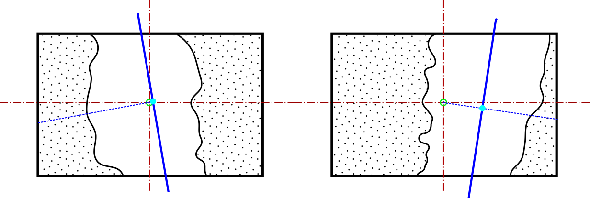

# Dataset generation based on synthetic images for obstacle avoidance algorithms.
To get good results on on neural network trainings a bunch of dataset correctly labelled is needed. This process is often very costly and tedious so this project shows a way of generating good a good quality dataset reducinf the amount of effort needed by using some python algorithms.

In this Readme you will find a brief description of this repository.
Later on, more information will be added since this project is still being carried out.

## Centromasas_Coll

The aim of this algorith is to locate all the non-collision points within an image. This way the objectif point (ground truth) will point to a safe area where the drone will be able to fly safely.

The point will be calculated computing the center of mass formula in all the non-collision points. The problem is that this algorithm have presents some singularities such as if the drone bumps into a tree in the middle of its trajectoy the aim point will be on the tree, so it will be driving the dron directly into the tree. The following images show some singularity examples:

## Regresion

## Sectorizacion

## pfm2png
This script decode the images extracted from Airsim in .pfm extension, into .png.
.pfm is an extension that ensures that the characters and the glyphs are correctly scaled. It is used in Airsim since depth is coded in decimal numbers within 0 and 1.
## Threading
## Rotate
## frame2vid
