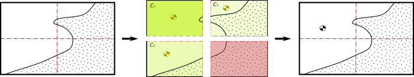

# Dataset generation based on synthetic images for obstacle avoidance algorithms.
To get good results on on neural network trainings a bunch of dataset correctly labelled is needed. This process is often very costly and tedious so this project shows a way of generating good a good quality dataset reducinf the amount of effort needed by using some python algorithms.

In this Readme you will find a brief description of this repository.
Later on, more information will be added since this project is still being carried out.

## Centromasas_Coll

The aim of this algorith is to locate all the non-collision points within an image. This way the objectif point (ground truth) will point to a safe area where the drone will be able to fly safely.

The point will be calculated computing the center of mass formula in all the non-collision points. The problem is that this algorithm have presents some singularities such as if the drone bumps into a tree in the middle of its trajectoy the aim point will be on the tree, so it will be driving the dron directly into the tree. The following images show some singularity examples:

## Regresion
This algorithm is born to solve the singularities of the former code. The operating principle is quite similar, but this time, instead locating non-collision pixels, it will locate the position and main direction of all the collision pixels with a regresion line. 
To place the aim point, a perpendicular line that passes through the center of the image will be drawn. And finally, de distance form the lines intersection to the aim point will be inversely porportional to the amount of collision pixels in the current image.

There are also some singularities, for example when the collision pixels are in both borders of the images. In this case, the regresion line will be in  the middle of the image and the distance to the aim point will lead the dron to the collision area. 

## Sectorizacion
This algorithm tries to overcome all the singularities seen before integrating the simplicity of the "Center of mass" algoritm.
Firstly the image is divided into four subimages. Here the three subimages with less collision pixels will be selected as they are deem to be safer and the center of mass will be computed in the three of them.
Finally,the aim point will be calculated using the center of mass the threeimages and the formula of the enter of mass again.

## pfm2png
This script decode the images extracted from Airsim in .pfm extension, into .png.

.pfm is an extension that ensures that the characters and the glyphs are correctly scaled. It is used in Airsim since depth is coded in decimal numbers within 0 and 1.
## Threading
## Rotate
## frame2vid
